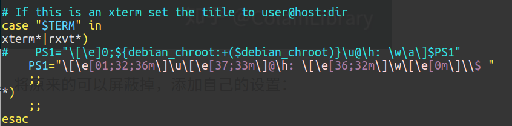

# Ubuntu 16.04 美化教程

> references: 
>
> 1. https://www.cnblogs.com/figowho/p/7895718.html : ubuntu 16.04简易美化教程
> 2. https://www.jianshu.com/p/4bd2d9b1af41 : 不美翻怎么开发!Ubuntu 16.04 LTS深度美化!(2017年度定稿版)


## 需要安装的软件

* unity-tweak-tool
* Theme : Flatabulous
* icrons : Ultra-flat

### 1. 安装主题管理软件：

```bash
sudo apt-get install unity-tweak-tool 
```

### 2. 安装Flatabulous主题

```bash
sudo add-apt-repository ppa:noobslab/themes
sudo apt-get update
sudo apt-get install flatabulous-theme
```

注： 如果加载不了源试试换个网络，接入手机热点等。

### 3. 安装Ultra-flat图标

```bash
sudo add-apt-repository ppa:noobslab/icons
sudo apt-get update
sudo apt-get install ultra-flat-icons
```

### 4. 在第一步安装的主题管理软件中设置主题图标等

分别将`Theme`和`Icons`设置为刚才安装的即可，也可以试试其他的不同主题（自行Google）；


### 5. Terminal美化

还可以将terminal设置为透明背景等；


## docky 安装

```bash
sudo apt-get install docky
```


## 修改Ubuntu下终端用户名颜色

> Terminator默认的用户名颜色与命令颜色一致，很不方便查阅

```bash
sudo gedit ~/.bashrc
```

找到以下位置：



修改`PS1+= " "` 

```
PS1="\[\e[01;32;36m\]\u\[\e[37;33m\]@\h: \[\e[36;32m\]\w\[\e[0m\]\\$ "
```

上述命令中**[01;32;36m]**表示**[状态值;前景色;背景色]**。可以根据自己需求，把下方表格的值换过去。


### terminator配置

terminator安装

```bash
sudo apt install terminator
```

配置文件如下：

```
cd .config/terminator/
vim config
```

这里我的配置文件如下：

```
[global_config]
  suppress_multiple_term_dialog = True
[keybindings]
[layouts]
  [[default]]
    [[[child1]]]
      parent = window0
      type = Terminal
    [[[window0]]]
      parent = ""
      type = Window
[plugins]
[profiles]
  [[default]]
    background_color = "#002b36"
    background_darkness = 0.68
    background_image = /home/julius/Downloads/wallhaven-72159y.jpg  #背景图片地址
    background_type = image
    cursor_color = "#3036ec"
    custom_command = tmux
    font = Monospace 13
    foreground_color = "#839496"
    login_shell = True
    palette = "#000000:#cc0000:#4e9a06:#c4a000:#3465a4:#75507b:#06989a:#d3d7cf:#555753:#ef2929:#8ae234:#fce94f:#729fcf:#ad7fa8:#34e2e2:#eeeeec"
    show_titlebar = False
    use_system_font = False
```

这些配置都可以在terminator页面右键鼠标`profiles`中设置；


