# 玩转Makefile

> 学习make命令的使用及makefile的相关编写技巧。

## 1. 文档介绍 

#### 1. 实验知识点

 - make 工具的使用
 - makefile 规则的概念
 - makefile 变量的使用
 - makefile 函数的使用
 - makefile 自动生成依赖

 #### 2. 实验环境

 - xfce 终端(terminal)
 - vim 编辑器

## 2. 学习内容

在介绍makefile和make的具体概念前，我们先通过一个例子来说明makefile和make到底是为解决什么问题而存在的。

假设有一个如图所示的C工程：

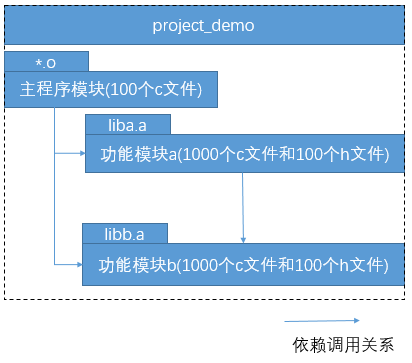

那么要编译出我们的可执行程序project_demo，必须执行以下命令：

```
# 步骤1：编译主程序模块
$ gcc -o <100个主程序模块的o文件> -c <100个主程序模块的c文件>

# 步骤2：编译功能模块a
$ gcc -o <1000个功能模块a的o文件> <1000个功能模块a的c文件>
$ ar rcs liba.a <1000个功能模块a的o文件>

# 步骤3：编译功能模块b
$ gcc -o <1000个功能模块b的o文件> <1000个功能模块b的c文件>
$ ar rcs libb.a <1000个功能模块b的o文件>

# 步骤4：生成可执行文件demo
$ gcc -o demo <100个主程序模块的o文件> -L. -la -lb
```

上述例子反映了两个问题：

> 1. 上述4个编译步骤中，几乎每个步骤都有冗长的文件名列表需要输入而且有些还是重复的，这种工作枯燥而又费时，且极易因人为疏忽而出现错误；
> 2. 假设我们的demo项目每次编译所需的时间都比较长，那么如果我们之前已经成功编译过了我们的demo项目，而此后当我们修改了某些源文件需要更新的demo文件时，理论上我们是不希望也不需要去重新编译整个项目的，我们只需要仅分析其中的依赖关系，仅执行需要重新编译链接的命令，以节省编译时间，但是对于依赖关系非常复杂的工程而言，分析源文件涉及到的依赖关系是个非常复杂且容易出错的过程。

make和makefile的存在正是为了解决上述两个问题的：

> 1. makefile文件帮助我们记录了整个项目工程的所有需要编译的文件列表，这样我们在编译时仅需要输入简单的make命令就能编译出我们期望的结果
> 2. makefile文件反映了整个项目中各个模块的依赖关系，这样我们改动了某些源文件后，仅需简单的输入make命令，make工具就会根据makefile文件里描述的依赖关系帮助我们分析哪些模块需要重新编译，并执行相应的操作。

在linux/unix开发环境中，makefile文件则是描述了一个特定编译系统所需要的策略，而make工具则是通过解析makefile文件并执行相应的命令来帮助我们构建其编译系统。

下面我们就带着这样两个问题来认识makefile和make工具：

> 1. makefile如何记录整个项目工程的所有需要编译的文件列表及如何反映整个项目中各个模块的依赖关系？
> 2. 提供了makefile策略描述后，make工具又是是如何解析makefile文件来帮助我们构建其编译系统的？


### 2.1 关于Makefile

#### 2.1.1 makefile 简介

makefile就是一个简单的文本文件，它基本上就是由一条条的规则构成。下面，我们就来看一下makefile里的最基本的语法单元，**规则**。一条makefile的规则构成如下：

> ```
> target:prerequisites
> <tab> command1
> <tab> command2
> .....
> <tab> commandN
> ```

> - target：规则的目标，可以简单理解为这条规则存在的目的是什么。通常是程序中间或者最后需要生成的文件名，也可以不对应具体的文件，而仅仅就是个概念上的规则目标。
>
> - prerequisites：规则的依赖列表，可以简单的理解为要达到本条规则的目标所需要的先决条件是什么。可以是文件名，也可以是其他规则的目标；
>
> - command：规则的命令，可以简单的理解为当目标所需要的先决条件的满足了之后，需要执行什么动作来达成规则的目标。规则的命令其实就是shell命令。一条规则中可以有多行命令，**特别注意：每行命令都必须以tab键开始！**

下面我们就立马来感性的认识一下makefile文件，先来一个"hello world"吧，编写 makefile 文件 /home/shiyanlou/Code/makefile：

```
# 最简单的makefile文件
all: 
    echo "Hello world!"  #注意：每行命令都必须以tab键开始！
```

这个简单的makefile文件，只有一条规则，规则的目标是all，没有任何依赖(**规则不可以没有目标但是可以没有依赖**)，以及一条命令(其实规则也是可以不需要任何命令的)。怎么用这个makefile呢？

打开Xcfe通过vim将上述内容写入一个叫makefile的文件中，并执行make

```bash
# open terminal
vim makefile  #edit makefile
make          #编译
```


#### 2.1.2 make 的工作机理

那make工具又到底是如何工作的呢？解释make的工作机理，需分别回答以下3个问题：

> 1. make命令如何使用 ；
> 2. make从哪读取makefile；
> 3. make如何解析执行makefile文件的规则。

make命令的基本使用范式如下：

> ```
> make [ -f makefile ] [ options ] ... [ targets ] ...
> ```

使用make命令的最简单的方式主要有以下四种形式：

> 1. 简单粗暴，不带任何参数，直接执行make：
>
>     ```bash
>     $ make
>     ```
>
> 2. 指定makefile文件：
>
>     ```bash
>     $ make -f <makefile_name>
>     ```
>
> 3. 指定 makefile 目标：
>
>     ```bash
>     $ make <target>
>     ```
>
> 4. 到指定目录下执行make：
>
>     ```bash
>     $ make -C <subdir> <target>
>     ```

在执行make的时候，我们可以带上`-f <文件名>`参数，来指定make命令从哪里读取makefile文件；而如果我们不显式指定，则make就会在当前目录下依次查找名字为**GNUmakefile, makefile,和 Makefile**的文件来作为其makefile文件。

在读取完makefile的内容后，make工具并不是逐条去执行makefile里的规则，而是以某条规则为突破口，多米诺骨牌效应式的去执行makefile里的规则。而这条作为突破口的规则的目标，称为**终极目标** ，我们可以在执行make时以参数的形式指定终极目标，从而执行作为突破口的规则，如果我们不显式指定终极目标，make一般情况下将选择makefile的第一条规则的目标作为终极目标。

一般情况下，make执行一条规则的具体过程是这样的：

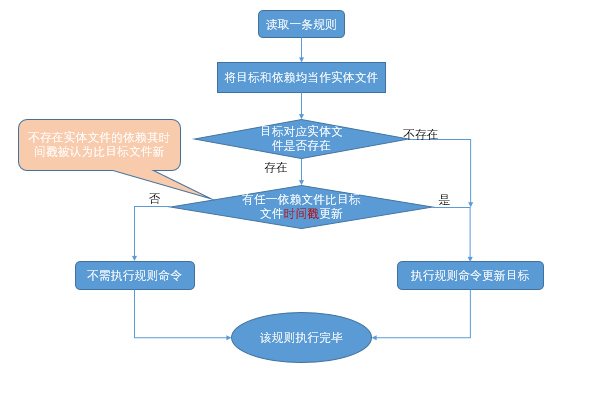

make解析makefile的流程如下：

假设有mekefile内容如下：

> ```
> 终极目标：依赖A  依赖B 依赖C
>     终极目标命令
>     
> 依赖A：子依赖A1 子依赖A2 
>     依赖A命令
>     
> 依赖B：子依赖B1 子依赖B2 
>     依赖B命令
> 
> 依赖C：子依赖C1 子依赖C2 
>     依赖C命令
> ```

过程一，以终极目标为树根，解析出整颗依赖树：

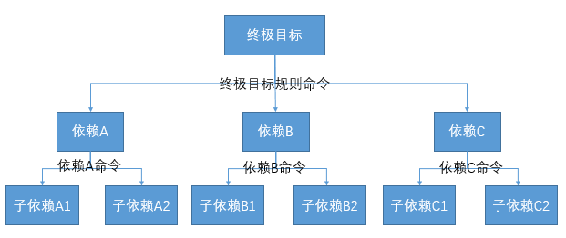

过程二，对整颗依赖树以从底到上，从左到右的顺序，解析执行每一条规则：

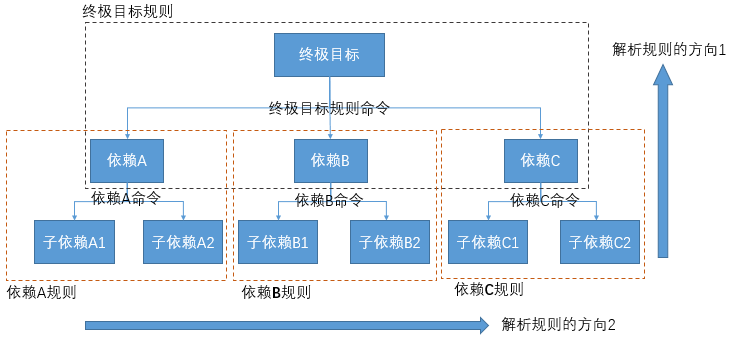


### 2.2 Makefile基本概念实例

本节我们将通过构建一个简单的c语言项目工程(我们命名为project_simple)来理解makefile的基本概念。

先来看一下project_simple的整体目录结构：

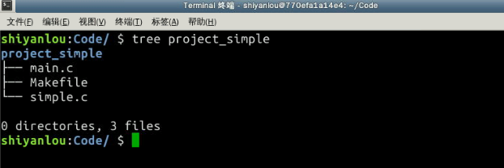

下面，我们先来一步步构建我们的项目：

创建工程目录 /home/shiyanlou/Code/project_simple/：

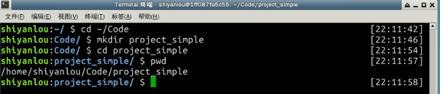

#### 2.2.1 main.c 文件

编写源代码文件 /home/shiyanlou/Code/project_simple/main.c：

```
$ cat > main.c <<EOF
extern void simple();

int main()
{
    simple();
    return 0;
}
EOF
```

结果如下：

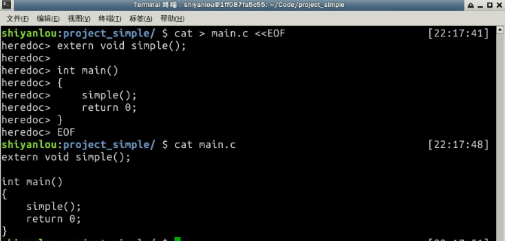

#### 2.2.2 simple.c 文件

编写源代码文件 /home/shiyanlou/Code/project_simple/simple.c：

```
$ cat >simple.c <<EOF
#include <stdio.h>

void simple()
{
    printf("This is simple project!\n");
}
EOF
```

结果如下：

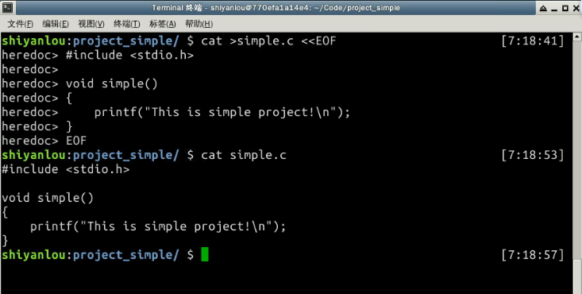

#### 2.2.3 Makefile 文件

最后就是要编写我们的makefile了，一般在编写makefile之前都需要先分析清楚整个工程各个模块的依赖关系，及相应的生成命令。我们的project_simple工程最终生产的是一个叫simple的可执行文件，而该可执行文件是使用gcc命令编译main.c和simple.c生成的，因此我们的整个工程的关系依赖图，如下：

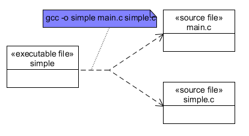

因此我们的makefile可以这么写：

> ```
> simple: main.c simple.c
>     gcc -o simple main.c simple.c
> ```

接下来，我们来编写 /home/shiyanlou/Code/project_simple/Makefile：

```
$ cat > Makefile <<EOF
simple: main.c simple.c
    gcc -o simple main.c simple.c
EOF
```

#### 2.2.4 运行验证 Makefile

下面我们分三个步骤来验证一下我们的simple项目的编译系统：

1. **能否编译出可执行的simple**

    ```
    $pwd        #查看当前路径
    $ls         #查看编译前当前目录
    $make       #编译simple项目
    $ls         #查看编译结果
    $./simple   #执行simple可执行文件
    ```

    过程及结果如下：

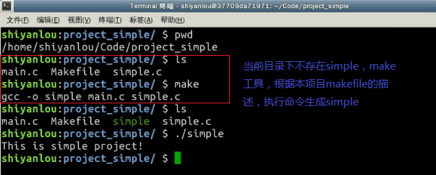

1. **已经编译出simple后，不改变任何源文件再次执行编译，是否不再执行任何操作**

    ```
    $ ls -lt #查看当前项目中各文件时间戳
    $ make   #再次执行编译，查看是否会执行编译命令
    ```

过程及结果如下：

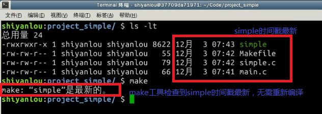

1. **已经编译出simple后，修改任一源文件是否能再次生成新的simple可执行文件**

    ```
    $ ls -lt       #对比当前项目各文件时间戳
    $ touch main.c #将main.c文件的时间戳修改至最新
    $ ls -lt       #查看main.c的时间戳是否最新
    $ make         #执行编译命令
    $ ls -lt       #查看simple的时间戳是否被更新至最新
    ```

过程及结果如下：

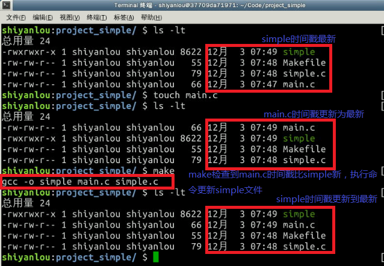


### 2.3 丰富我们的Makefile语法工具箱（一）

在第 2.2 节中，我们了解到makefile中最主要的语法单元是规则。本章我们将学习makefile中为了帮助我们更高效的编写出更加实用灵活的makefile而存在的帮助性语法。

以下是一般情况下一个完整的makefile所包含的语法模块：

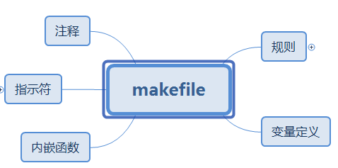

#### 2.3.1 complicated 项目构建

我们仿照project_simple项目，构建一个名为project_complicated的项目工程，目录结构如下：

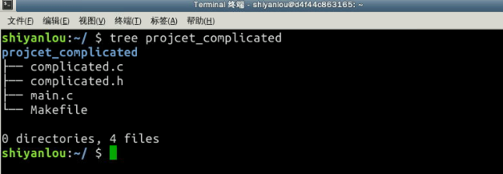

- 编写源代码文件 /home/shiyanlou/Code/project_complicated/main.c：

```c++
// ---------------------------------------------
// main.c
#include <stdio.h>
#include "complicated.h"
int main()
{
    printf("%s\n", HELLO_STRING);
    complicated();
    return 0;
}
```

- 编写源代码文件 /home/shiyanlou/Code/project_complicated/complicated.h：

```c
// ---------------------------------------------
// complicated.h
#ifndef ____COMPLICATED_H__
#define __COMPLICATED_H__
#define HELLO_STRING "Hello !"
#define PROJECT_NAME "complicated"
extern void complicated(void);
#endif
```

- 编写源代码文件 /home/shiyanlou/Code/project_complecated/complicated.c：

```c
// ---------------------------------------------
// complicated.c
#include <stdio.h>
#include "complicated.h"
void complicated(void)
{
    printf("This is a %s porject!\n", PROJECT_NAME);
}
```

项目的依赖关系：

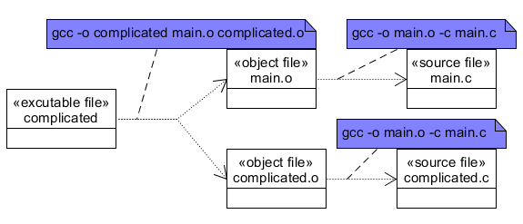

对比simple项目，我们的complicated项目貌似只是多了一个头文件，但是我们的依赖关系图却多了一层.o文件，这是为何？

> 熟悉gcc编译过程的朋友应该知道，其实我们在用gcc 编译出可执行文件的过程中是包含两个阶段的：编译阶段和链接阶段。

我们上述的依赖关系图更加准确的反映出了整个项目的构建过程，这样我们据此写出来的makefile才能更加灵活及更具可扩展性，记住：**精确的分析清楚项目的依赖关系，是编写一个好的makefile的关键。**

至此，我们可以写出complicated项目的文件 /home/shiyanlou/Code/project_complicated/makefile 了：

```
complicated: main.o complicated.o
    gcc -o complicated main.o complicated.o

main.o: main.c
    gcc -o main.o -c main.c
    
complicated.o: complicated.c
    gcc -o complicated.o -c complicated.c
```

验证过程及结果如下：

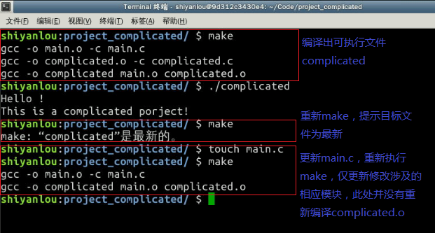

#### 2.3.2 使用`注释`提升可维护性

在计算机编程界，有这么一句谚语：

> 代码的目的是给人阅读的,只是顺便能让机器运行而已。

虽然这话听起来有点夸张，但它其实是在强调，编写可维护代码的重要性。而一段代码可维护性强的一个重要标志就是要有**恰到好处的注释**，所谓恰到好处是指注释要控制到“多一分嫌胖，少一分则嫌瘦”的境界。

> makefile中`“#”`字符后的内容被作为是注释内容（和shell脚本一样）处理。
>
> 如果此行的第一个非空字符为`“#”`，那么此行为注释行。
>
> 注释行的结尾如果存在反斜线（`\`），那么下一行也被作为注释行。
>
> 当在makefile中如果需要使用字符“#”时，可以使用反斜线加“#”（`\#`）来实现，其表示将“#”作为一字符而不是注释的开始标志。

我们来演示一下下面的makefile，创建 /home/shiyanlou/Code/makefile_sample/ 文件夹，并编写makefile 文件 /home/shiyanlou/Code/makefile_sample/comment.mk：

```
# 这是一个演示注释语法的makefile
all: test #关于依赖的注释
#    echo "Makefile for comment 1"   这里是注释，不是命令
    echo "Makefile for comment 2" 
# 这是一个关于test规则的 \
  多行注释
test:
# 没有反斜线\, #被当作注释的开始
    echo this is a # test rule1 
# 加上反斜线\, #被当作普通字符
    echo this is a \# test rule2 
```

> 一般在书写makefile时推荐将注释作为一个独立的行，而不要和makefile的有效行放在一行中书写。

使用命令`make -f comment.mk`执行该makefile，过程及结果如下：

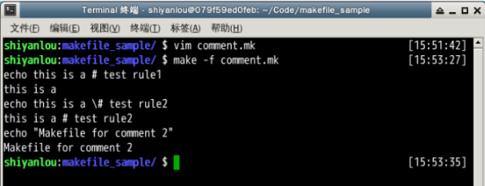

可见make在执行时一般情况下对于makefile中以`#`开始到行尾的内容都是直接忽略不做任何处理的。

更新complicated项目的makefile版本，我们定上一节的makefile版本为v1.0，这个版本为v1.1：

```
# 描述：complicated 项目 makefile文件
# 版本：v1.1
# 修改记录：
# 1. 为complicated项目makefile添加注释

# 终极目标规则，生成complicated可执行文件
complicated: main.o complicated.o
    gcc -o complicated main.o complicated.o

# 子规则1, main.o的生成规则
main.o: main.c
    gcc -o main.o -c main.c
    
# 子规则2，complicated.o的生成规则
complicated.o: complicated.c
    gcc -o complicated.o -c complicated.c
```

v1.1版本相对于v1.0仅仅添加了相关的注释，对makefile描述的实际功能没有任何影响，读者可依照上节的例子自行验证v1.1版本。


### 2.4 丰富我们的Makefile语法工具箱（二）

#### 2.4.1 变量的定义

makefile中的变量，与C语言中的宏类似，它为一个文本字符串（变量的值，其类型只能是字符串类型）提供了一个名字(变量名)。

变量定义的基本格式：

```
变量名 赋值符 变量值
```

> - 变量名指的就是该变量的名字，是不包括“:”、“#”、“=”、前置空白和尾空白的任何字符串。需要注意的是，尽管在GNU make中没有对变量的命名有其它的限制，但定义一个包含除字母、数字和下划线以外的变量的做法也是不可取的，因为除字母、数字和下划线以外的其它字符可能会在以后的make版本中被赋予特殊含义，并且这样命名的变量对于一些shell来说不能作为环境变量使用。变量名是大小写敏感的。变量“foo”、“Foo”和“FOO”指的是三个不同的变量。Makefile传统做法是变量名是全采用大写的方式。推荐的做法是在对于内部定义定义的一般变量（例如：目标文件列表objects）使用小写方式，而对于一些参数列表（例如：编译选项CFLAGS）采用大写方式。
>
> - 变量值，指的是变量所代表的内容，可以是一个文件名列表、编译选项列表、程序运行的选项参数列表、搜索源文件的目录列表、编译输出的目录列表和所有我们能够想到的事物。变量的值，其本质就是一个字符串。
>
> - 赋值符，有`=` 、 `:=` 、 `?=`和 `+=`四种格式，其中`=` 和 `:=` 为基本定义类型， `?=`和 `+=`为基于`=`的扩展定义类型。

一个在makefile中定义变量的例子：

> ```
> objects = program.o foo.o utils.o
> ```

#### 2.4.2 变量的引用

当我们定义了一个变量之后，我们就可以在makfile中的**目标**、**依赖**、**命令**中引用我们的变量；而所谓的变量引用，就是在引用变量名的地方，用变量所代表的内容，执行一个严格的文本替换过程(该过程也称为变量**被展开的过程** )，替换掉变量的名字。

变量的引用有以下几种方式：

> 1. `${变量名}`
> 2. `$（变量名）`
> 3. `$单字符变量名` ，变量名仅包含一个字符，如`$@` 、`$^`等

一个在makefile中引用变量的例子：

```
# 变量定义
objects = program.o foo.o utils.o

program : $(objects)          #在依赖中引用变量
    gcc -o program ${objects} #在命令中引用变量

$(objects) : defs.h           #在目标中引用变量
```

#### 2.4.3 变量的分类与赋值

根据变量定义时所使用的赋值操作符的不同，可以将变量分成两种类型(或者说是两种风格)：

`递归展开式变量`和`直接展开式变量`；

> 使用赋值操作符`=` 、 `+=` 和 `?=`定义的变量都是**递归展开式变量**，使用赋值操作符 `:=`定义的变量为**直接展开式变量** 。
>
> 两种变量类型的的最根本区别在于：**变量值的求值时机**，递归式变量的求值时机在于**变量被引用时**，直接展开式的求值时机在于**变量被定义时**。

我们来编写makefile 文件 /home/shiyanlou/Code/makefile_sample/variabletype.mk：

```
foo1 = $(bar)   #递归展开式变量
foo2 := $(bar)  #直接展开式变量
bar = $(ugh)
ugh = Huh?

all:
    echo "foo1 is $(foo1), foo2 is $(foo2)"
```

然后，使用 `$ make -f variabletype.mk` 执行variabletype.mk，演示及结果如下：


由于变量`foo1`的变量值是在执行`echo`命令时才求的值，所以`foo1`的值被递归的展开为`Huh?`； 而变量`foo2`的变量值在定义时就被求值了，此时由于变量`bar`的值为空，因此`foo2`的值也为空。

> **注意：使用递归展开式的变量定义，可能会由于出现变量的递归定义而导致make陷入到无限的变量展开过程中，最终使make执行失败**

`+=` 和 `?=`是基于`=`扩展而来的两种变量赋值操作符；

`+=` 称为追加赋值操作符，它实现对于一个已经存在定义的变量进行追加赋值，如下例子：

> ```
> bar = foo1   
> bar += foo2  #追加赋值，bar的值将为 foo1 foo2
> 
> all:
>     echo $(bar)
> ```

`?=`称为条件赋值的赋值操作符，被称为条件赋值为：只有此变量在之前没有赋值的情况下才会对这个变量进行赋值。看一下例子：

> ```
> bar1 = foo1
> bar1 ?= foo2  # bar1 的值还是foo1
> bar2 ?= foo2  # bar2 的值为foo2
> 
> all:  
>     echo "bar1 is $(bar1), bar2 is $(bar2)" 
> ```

#### 2.4.4 特殊的变量

在makefile 中用户除了可以自定义变量外，还可以使用make工具为我们提供的一些特殊的变量及用法。

- 自动化变量

所谓自动化变量，就是在每条规则中，make自动为我们提供的用于指定规则各个组成部分的变量，一般情况下常用的有以下几个自动化变量：

> `$@` -- 代表规则中的目标文件名
>
> `$<` -- 代表规则的第一个依赖的文件名
>
> `$^` -- 代表规则中所有依赖文件的列表，文件名用空格分割

看例子，编写makefile 文件 /home/shiyanlou/Code/makefile_sample/auto_var.mk：

```
all: first second third
    echo "\$$@ = $@"
    echo "$$< = $<"
    echo "$$^ = $^"

first second third:
```

这里有几点需要说明一下：

> 1. `$`字符在makefile中有特殊用途，因此如果要取消其特殊用途当成一个普通字符传递给`echo`命令执行，需要使用`$$`
> 2. `$@`在bash shell中也有特殊用途，因此如果希望`echo`命令在bash中正常输出`$@`， 需要加上`\`字符
> 3. 该makefile的最后一行`first second third:` 看起来有点奇怪，这是一条**没有依赖和命令的多目标规则**，读者可自行将它删除看有什么效果，并思考原因。

演示及结果如下：


#### 2.4.5 变量的替换引用

- 变量的分类与赋值

对于一个已经定义的变量，可以使用“替换引用”将其值使用指定的字符（字符串）进行替换。格式为`$(VAR:A=B)`或者`${VAR:A=B}`，意思是，将变量“VAR”所表示的值中所有字符串“A”结尾的字符替换为“B”的字。“结尾”的含义是空格之前（变量值的多个字以空格分开）。而对于变量其它部分的“A”字符不进行替换。例如：

> ```
> sources := a.c b.c c.c d.d
> objects := $(sources:.c=.o)
> all:
>     echo "objects = $(objects)"
> ```

在这个定义中，变量“objects”的值就为“a.c b.c c.c d.d”。使用变量的替换引用将变量“sources”以空格分开的值中的所有的字的尾字符“o”替换为“c”，其他部分不变，注意这里的`d.d`并不会被替换。

使用变量改进我们complicated项目的makefile(v1.2)：

```makefile
# 描述：complicated 项目 makefile文件
# 版本：v1.2
# 修改记录：
# 1. 为complicated项目makefile添加注释
# 2. 使用变量改进我们complicated项目的makefile

# 定义可执行文件变量
executbale := complicated
# 定义源文件列表变量
sources := main.c complicated.c
# 使用变量的引用替换，定义object文件列表
objects := $(sources:.c=.o)
# 定义编译命令变量
CC := gcc

# 终极目标规则，生成complicated可执行文件
$(executbale): $(objects)
#  使用自动化变量改造我们的编译命令
    $(CC) -o $@ $^

# 子规则1, main.o的生成规则
main.o: main.c
    $(CC) -o $@  -c $<
    
# 子规则2，complicated.o的生成规则
complicated.o: complicated.c
    $(CC) -o $@  -c $<
```

### 2.5 更深入的认识Makefile的规则（一）

#### 2.5.1 多目标规则与多规则目标

- 多目标规则

多目标规则，可以简单的理解为是一种将多条具有**1)相同依赖**和**2)相同生成命令**的规则，合并成一条规则的语法，其基本格式为：

> ```
> targets...: prerequisites...
>     commands
>     ...
> ```

假设我们有以下makefile：

> ```
> all: target1 target2
>     echo "This is a rule for $@"
> 
> target1: dep
>     echo "This is a rule for $@"
>     
> target2: dep
>     echo "This is a rule for $@"
> 
> dep:
> ```

利用多目标规则，可以将makefile改写成 makefile 文件 /home/shiyanlou/Code/multi_targets.mk：

```
all: target1 target2
    echo "This is a rule for $@"

# 利用多目标规则合并 target1 和target2的规则
target1 target2: dep
    echo "This is a rule for $@"
    
dep:
```

演示及结果如下：


这里我们可以观察到，虽然多目标规则中要求命令必须相同，但是配合上自动化变量的使用，就是可以针对不同的目标有不同的执行结果。

- 多规则目标

Makefile中，一个目标可以同时出现在多条规则中。

> 这种情况下，此目标文件的所有依赖文件将会被合并成此目标一个依赖文件列表，其中任何一个依赖文件比目标更新（比较目标文件和依赖文件的时间戳）时，make将会执行特定的命令来重建这个目标
>
> 。对于一个多规则的目标，**重建此目标的命令只能出现在一个规则中**（可以是多条命令）。
>
> 如果多个规则同时给出重建此目标的命令，make将使用最后一个规则的命令，同时提示错误信息。

#### 2.5.2 静态模式规则

仔细观察我们的complicated项目中的两条子规则：

> ```
> # 子规则1, main.o的生成规则
> main.o: main.c
>     $(CC) -o $@  -c $<
>     
> # 子规则2，complicated.o的生成规则
> complicated.o: complicated.c
>     $(CC) -o $@  -c $<
> ```

我们发现它们长得很像，好像一个模子里印出来的：

> 首先**它们的命令是一样的**，
>
> 其次它们目标依赖关系有点相似(目标都是以.o结尾的文件，依赖都是以.c结尾的文件)。

对于这种长得很像的规则，makefile提供了一种称为**静态模式规则**的规则来帮助我们简化规则的编写。

静态模式规则：

> 可以理解为一种特殊的多目标规则，它仅要求多条规则具有相同的命令，而依赖可以不完全一样。

静态模式规则，其基本语法：

> ```
> TARGETS ...: TARGET-PATTERN: PREREQ-PATTERNS ...
>     COMMANDS
>     ...
> ```

其大致意思就是，用`TARGET-PATTERN: PREREQ-PATTERNS ...`描述的模式，从`TARGETS ...`取值来形成一条条规则，所有规则的命令都用`COMMANDS`。

`TARGETS ...`代表具有相同模式的规则的目标列表，在我们的项目中就是main.o和complicated.o，我们可以直接引用我们先前定义的objects变量。

`TARGET-PATTERN: PREREQ-PATTERNS ...`部分定义了，如何为目标列表中的目标，生成依赖；`TARGET-PATTERN`称为目标模式，`PREREQ-PATTERNS`称为依赖模式；目标模式和依赖模式中，一般需要包含模式字符`%`。

目标模式的作用就是从目标列表中的目标匹配过滤出需要的值，目标模式中的字符`%`表示在匹配过滤的过程中不做过滤的部分，目标模式中的其他字符表示要与目标列表中的目标精确匹配，例如，目标模式`%.o`， 表示从目标列表的目标中匹配所有以`.o`结尾的目标，然后过滤掉匹配目标的`.o`部分， 因此目标`main.o`经过目标模式`%.o`匹配过滤后，得到的输出就是`main`。

依赖模式的作用就是表示要如何生成依赖文件。具体的生成过程，就是使用目标模式过滤出来的值，替换依赖模式字符`%`所表示的位置。因此，如果依赖模式为`%.c`， 则使用上述例子过滤出来的`main`来替换字符`%`， 最终得到依赖文件`main.c`

因此，我们可以这么用静态模式规则来简化我们的complicated项目：

> ```
> # 静态模式规则简化complicated makefile
> $(objects): %.o: %.c
>     $(CC) -o $@  -c $<
> ```

#### 2.5.3 伪目标

我们的complicated项目编译完成后，会有可执行文件及中间目标文件，有时出于某些需求，需要将编译生成的文件都删除，让整个项目回到最初的状态。我们可以在该项目makefile定义添加一条目标为`clean`的规则，如下：

```
# complicated项目添加clean 规则
clean:
    rm -rf complicated complicated.o main.o
```

演示如下： 

上述的clean规则，貌似能正常工作，但其实是存在bug的，当我们的目录下刚好存在一个叫做clean的文件时，事情就没那么顺利了：


出现以上问题的原因是，当编译目录下存在clean文件时，由于clean规则没有依赖，所以clean文件的时间戳永远显得都是最新的，故其命令也无法被执行，这时我们就得请伪目标出手帮助了。

当我们将一个目标定义成伪目标时，意味着它不代表一个真正的文件名，在执行make时可以指定这个目标来执行其所在规则定义的命令。

定义一个伪目标的基本语法：

```
.PHONY: <伪目标>
```

因此我们以定义complicated项目的clean目标，为伪目标，如下：

```
# complicated项目添加clean 规则
.PHONY: clean
clean:
    rm -rf complicated complicated.o main.o
```

这样目标`clean`就是一个伪目标，无论当前目录下是否存在`clean`这个文件。我们输入`make clean`之后。`rm`命令都会被执行。

演示如下： 


### 2.6 更深入的认识Makefile的规则（二）

#### 2.6.1 命令

- 命令的回显

通常，make在执行命令行之前会把要执行的命令行进行输出，如以下makefile：

> ```
> all:
>     echo "Hello world!"
> ```

在执行make时，其输出：

> ```
> $ make
>   echo "Hello world!"
>   Hello world!
> ```

关闭命令回显有以下几种方式：

> 1. 每个需要关闭回显的命令行前加上"@"字符，上述例子关闭回显：
>
>     ```
>     all:
>         @echo "Hello world!"
>     ```
>
> 2. 执行make时带上参数`-s`或`--slient`禁止所有执行命令的显示
>
> 3. 在Makefile中使用没有依赖的特殊目标`.SILENT`也可以禁止所有命令的回显

- 命令的执行

在Makefile中**书写在同一行中的多个命令属于一个完整的shell命令行**，**书写在独立行的一条命令是一个独立的shell命令行**。所以需要注意：在一个规则的命令中，命令行`cd`改变目录不会对其后的命令的执行产生影响。就是说其后的命令执行的工作目录不会是之前使用`cd`进入的那个目录。如果要实现这个目的**，**就不能把`cd`和其后的命令放在两行来书写。而应该把这两条命令写在一行上，用分号分隔。这样它们才是一个完整的shell命令行。

对比以下例子两个规则的输出，编写makefile 文件 /home/shiyanlou/Code/makefile_sample/cmd.mk：

```
target1:
    @echo "target1"
    @cd ~
    @pwd
    
target2:
    @echo "target2"
    @cd ~; pwd
```

例子演示： 

- 命令执行的错误处理

通常情况下，规则中的每一条命令在运行结束后，make都会检测命令执行的返回状态，如果返回成功，就执行下一条命令；命令出错（返回状态非0），make就会放弃对当前规则的执行，或者终止对当前makefile的解析执行。

在一些情况下，规则中的一个命令的执行失败并不代表规则执行的错误。为了忽略一些无关紧要的命令执行失败的情况，我们可以在命令之前加一个减号`-`，来告诉make忽略此命令的执行失败检查。

在更加深入的认识了makefile的规则后，我们complicated项目的makefile(v1.3)就可以这样写了：

```
# 描述：complicated 项目 makefile文件
# 版本：v1.3
# 修改记录：
# 1. 为complicated项目makefile添加注释
# 2. 使用变量改进我们complicated项目的makefile
# 3. 使用静态模式规则，简化makefile
# 4. 使用伪目标，加上clean规则

# 定义可执行文件变量
executbale := complicated
# 定义源文件列表变量
sources := main.c complicated.c
# 使用变量的引用替换，定义object文件列表
objects := $(sources:.c=.o)
# 定义编译命令变量
CC := gcc
RM := rm -rf

# 终极目标规则，生成complicated可执行文件
$(executbale): $(objects)
#  使用自动化变量改造我们的编译命令
    $(CC) -o $@ $^

# 子规则, main.o和complicated.o的生成规则，使用静态模式规则
$(objects):%.o:%.c
    $(CC) -o $@  -c $<
        
# clean规则
.PHONY: clean
clean:
    $(RM) $(executbale) $(objects)
```

#### 2.6.2 内嵌函数

make的内嵌函数为我们提供了处理文件名、变量、文本和命令的方法。使我们的Makefile更为灵活和健壮。我们可以在需要的地方调用函数来处理指定的文本（参数），函数在调用它的地方被替换为它的处理结果。函数调用（引用）的展开和变量引用的展开方式类似：

函数调用方式1：

> ```
> $(FUNCTION ARGUMENTS)
> ```

函数调用方式2：

> ```
> ${FUNCTION ARGUMENTS}
> ```

- 内嵌函数的分类


- 使用wildcard函数改进complicated项目makefile

wildcard函数，其使用范式：

> ```
> $(wildcard PATTERN)
> ```

> 函数名称：wildcard
>
> 函数功能：列出当前目录下所有符合模式“PATTERN”格式的文件名。
>
> 返回值：空格分割的、存在当前目录下的所有符合模式“PATTERN”的文件名。
>
> 函数说明：“PATTERN”使用shell可识别的通配符，包括`?`（单字符）、`*`（多字符）等。

示例： 

```
$(wildcard *.c) 
```

返回值为当前目录下所有.c源文件列表。

我们可以引进wildcard函数，改进complicated项目的makefile，使其能够自动扫描当前目录下的源文件：

```
# 描述：complicated 项目 makefile文件
# 版本：v1.4
# 修改记录：
# 1. 为complicated项目makefile添加注释
# 2. 使用变量改进我们complicated项目的makefile
# 3. 使用静态模式规则，简化makefile
# 4. 使用伪目标，加上clean规则
# 5. 引进wildcard函数，自动扫描当前目录下的源文件

# 定义可执行文件变量
executbale := complicated
# 引进wildcard函数扫描源文件，定义列表变量
sources := $(wildcard *.c)
# 使用变量的引用替换，定义object文件列表
objects := $(sources:.c=.o)
# 定义编译命令变量
CC := gcc
RM := rm -rf

# 终极目标规则，生成complicated可执行文件
$(executbale): $(objects)
#  使用自动化变量改造我们的编译命令
    $(CC) -o $@ $^

# 子规则, main.o和complicated.o的生成规则，使用静态模式规则
$(objects):%.o:%.c
    $(CC) -o $@ -c $<
        
# clean规则
.PHONY: clean
clean:
    $(RM) $(executbale) $(objects) 
```

演示如下：


### 2.7 自动生成依赖关系

至此，我们complicated项目的makefile已经完成的比较完善了，但还存在一个问题，当我们更新头文件complicated.h的内容后，执行make时，项目并不会重新编译，看演示： 

出现以上问题的根本原因是，我们的makefile还没能精确的反映整个项目工程的依赖关系！很明显，项目的依赖关系应该加入对于头文件的依赖，即如下图：


根据上述依赖关系，我们可以在makefile加上如下规则：

```
$(objects): complicated.h
```

上述新增规则，是一条多目标规则，它与之前的静态模式规则，又组成了多规则目标，读者可自行思考其工作原理。

上述规则加入虽然能解决我们的问题，但是对于大型复杂的项目，这种需要我们逐个去分析头文件被依赖的关系，几乎是不可能的。所以我们需要工具来帮我们做这个事。下面我们来介绍如何实现自动生成依赖关系。

gcc为我们提供了这样的功能，帮助我们分析一个文件对其他文件的依赖关系列表。当我们在执行gcc时带上`-MM`选项时，gcc工具就会为我们列出指定文件对其他文件的依赖关系列表。直接来看例子：


接下来要考虑的问题就是如何将gcc的输出导入到我们的makefile中了。

makefile支持使用`sinclude`关键字将指定文件导入到当前的makefile当中，它的作用与C语言的`#inlucde`预处理命令是一样的。使用方式`sinclude <other_makefiles>`。因此，我们可以将gcc对于源文件的依赖关系分析输出到某个文件(我们可以称为依赖描述文件，一般命名为与源文件同名但以.d结尾的文件)当中，然后再将依赖描述文件导入到makefile中。

> ```
> # 使用变量的引用替换，定义依赖描述文件列表
> deps := $(sources:.c=.d)
> 
> # 导入依赖描述文件列表
> sinclude $(deps)
> ```

当我们使用`sinclude`关键字向当前makefile导入文件时，如果所导入的文件不存在，make会试图去执行可以生产导入文件的规则去生产被导入的文件，然后再执行导入。因此我们可以使用静态模式规则，让make在执行时，去调用gcc生成依赖关系文件，我们可以这么写：

> ```
> $(deps):%.d:%.c
>     gcc -MM $< > $@
> ```

因此，我们complicated项目的最终makefile可以这么写：

```
# 描述：complicated 项目 makefile文件
# 版本：v1.5
# 修改记录：
# 1. 为complicated项目makefile添加注释
# 2. 使用变量改进我们complicated项目的makefile
# 3. 使用静态模式规则，简化makefile
# 4. 使用伪目标，加上clean规则
# 5. 引进wildcard函数，自动扫描当前目录下的源文件
# 6. 加入自动规则依赖

# 定义可执行文件变量
executbale := complicated
# wildcard函数扫描源文件，定义列表变量
sources := $(wildcard *.c)
# 使用变量的引用替换，定义object文件列表
objects := $(sources:.c=.o)
# 使用变量的引用替换，定义依赖描述文件列表
deps := $(sources:.c=.d)

# 定义编译命令变量
CC := gcc
RM := rm -rf

# 终极目标规则，生成complicated可执行文件
$(executbale): $(objects)
#  使用自动化变量改造我们的编译命令
    $(CC) -o $@ $^

# 子规则, main.o和complicated.o的生成规则，使用静态模式规则
$(objects):%.o:%.c
    $(CC) -o $@  -c $<
        
# clean规则
.PHONY: clean
clean:
    $(RM) $(executbale) $(objects) $(deps)

# 自动规则依赖
sinclude $(deps)

$(deps):%.d:%.c
    $(CC) -MM $< > $@
```

演示如下：


